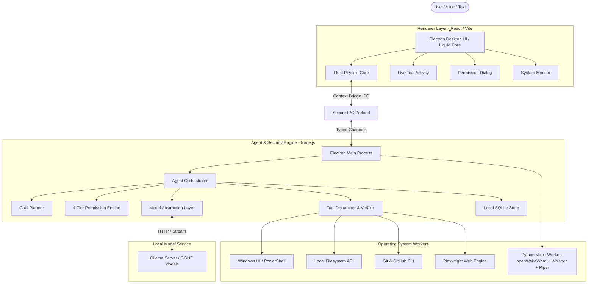
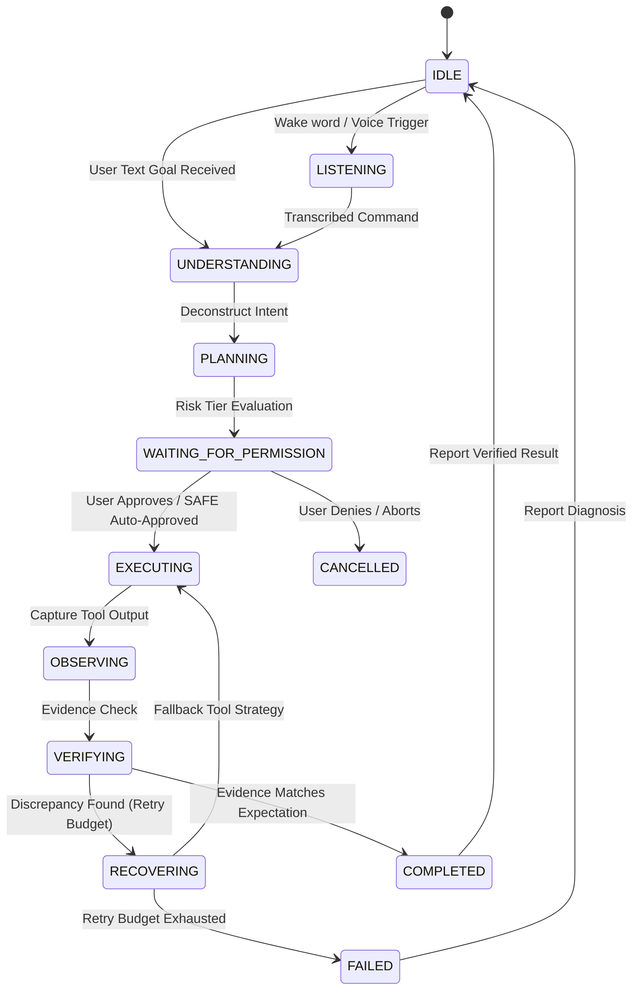

# AXIOM System Architecture

AXIOM is an open-source, local-first autonomous AI computer agent engineered specifically for Windows. It provides a natural-language operating layer that can inspect system state, plan multi-step workflows, request permissions for risky actions, execute native tools, and verify real results.

---

## 1. High-Level Modular Architecture



---

## 2. Autonomous Execution Lifecycle Loop

AXIOM never executes unverified or blind actions. Every task follows a deterministic state machine:



---

## 3. Subsystem Separation & Boundaries

| Subsystem | Location | Primary Responsibility | Isolation Guarantee |
| :--- | :--- | :--- | :--- |
| **Desktop Shell** | `apps/desktop` | Liquid visualization, command input, stream telemetry | Context-isolated; zero direct Node.js API access |
| **Agent Runtime** | `packages/agent` | Goal decomposition, execution loop, failure recovery | Strictly isolated from OS; interacts only via tools |
| **Permission Engine** | `packages/permissions` | Risk classification, grouped confirmation, audit logging | Evaluates all actions prior to dispatch; unbypassable |
| **Tool Registry** | `packages/tools` | Filesystem, terminal, windows, git, developer tools | Validates parameters, executes, and verifies evidence |
| **Model Abstraction** | `packages/models` | Local Ollama client, streaming, hardware-aware fallback | Replaces models dynamically without affecting agent code |
| **Memory Store** | `packages/memory` | Categorized persistent storage (facts, preferences, tasks) | Stores only user-transparent local data; no credentials |
| **Voice Pipeline** | `packages/voice` | Offline wake-word detection ("Axiom"), STT, and TTS | Operates locally without external cloud telemetry |

---

## 4. IPC Protocol & Security Gateways

1. **Context Isolation**: The renderer process runs in an isolated context with `nodeIntegration: false` and `sandbox: true`.
2. **Controlled Preload Bridge**: priviledged actions cannot be triggered arbitrarily. The renderer invokes strictly typed IPC handlers:
   - `axiom:agent:start-goal`
   - `axiom:agent:cancel`
   - `axiom:permission:response`
   - `axiom:system:get-metrics`
3. **Event Streaming**: Main process pushes state transitions, step updates, and verification telemetry down to the renderer in real-time.

---

## 5. Tool Verification Architecture

Every tool implementation adheres to the `ExecutableTool` contract:

```typescript
export interface ExecutableTool<TParams, TResult> {
  name: string;
  description: string;
  tier: RiskTier;
  execute(params: TParams): Promise<TResult>;
  verify?(params: TParams, result: TResult): Promise<VerificationResult>;
}
```

When an action executes (such as creating a file, writing code, or running a build), the tool's `verify` hook runs an independent post-condition check to gather concrete evidence (e.g. verifying `fs.existsSync(path)` or checking process exit codes). AXIOM **never** reports success based purely on an absence of runtime exceptions.
