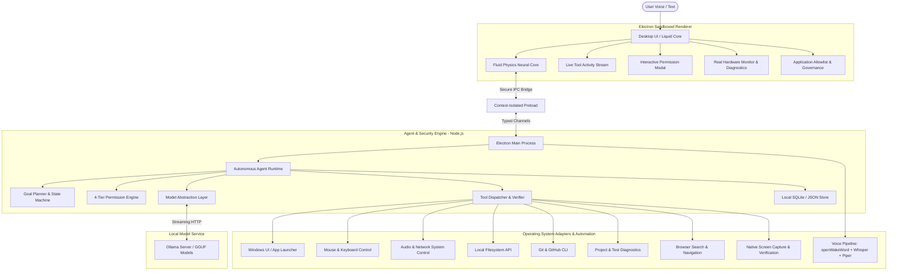
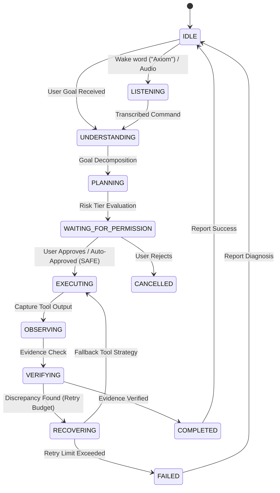
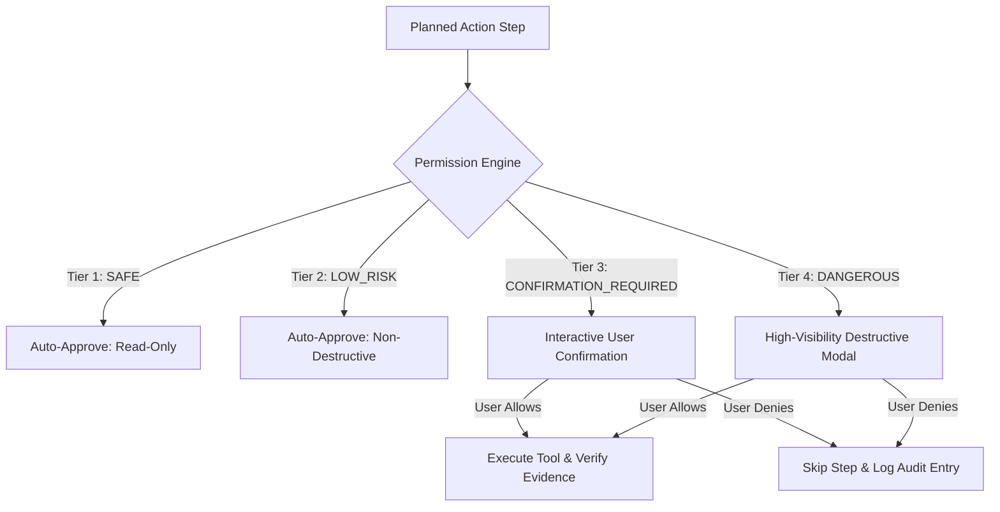
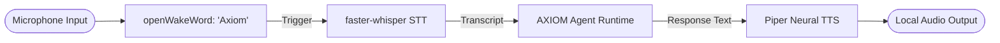
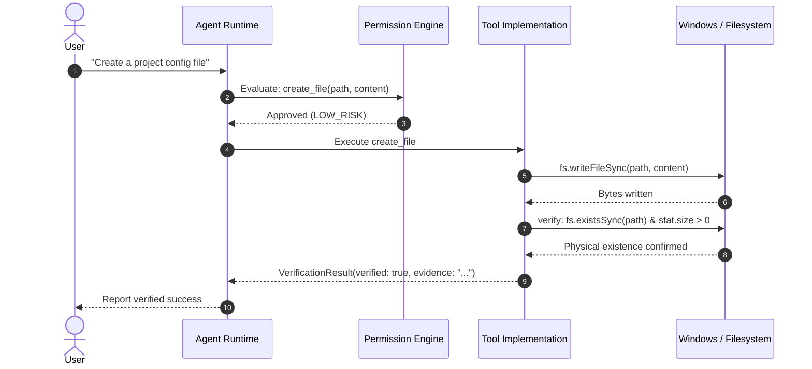

# AXIOM

<div align="center">

### *Your local intelligence. Your computer. Your control.*

[](https://opensource.org/licenses/Apache-2.0)
[](https://microsoft.com/windows)
[](https://www.typescriptlang.org/)
[](https://www.electronjs.org/)
[](https://ollama.ai/)
[](tests/)
[](#privacy-first-philosophy)

<p align="center">
  <strong>AXIOM</strong> is an open-source, local-first autonomous AI computer agent for Windows designed to understand natural-language goals, plan multi-step workflows, operate desktop tools, inspect files, assist with software development, and verify its work — while keeping the human in control.
</p>

</div>

---

## 1. System Architecture

AXIOM decomposes responsibilities into isolated, modular layers. The sandboxed Electron desktop interface connects via secure, strongly-typed IPC to the autonomous Node.js runtime, which coordinates tools, security evaluations, local Ollama models, and persistent memory.



---

## 2. Autonomous Execution Loop

AXIOM does not simply answer questions — it performs computer actions with verified feedback. Every goal follows a deterministic execution lifecycle:



---

## 3. The 4-Tier Permission Model

The AI never has unrestricted, silent access to your operating system. Dangerous operations require explicit authorization.



| Tier | Policy | Trigger Conditions |
| :--- | :--- | :--- |
| **SAFE** | Auto-Approved & Logged | Reading files, searching directories, checking Git status, inspecting processes, querying system/network status |
| **LOW_RISK** | Auto-Approved with Telemetry | Launching applications, window focus, clipboard interactions, non-destructive mouse moves |
| **CONFIRMATION_REQUIRED** | **Requires User Approval** | Modifying existing files, running arbitrary PowerShell scripts, pushing to Git, typing keystrokes, adjusting volume |
| **DANGEROUS** | **Requires Explicit Confirmation** | Deleting files or directories, force push, system service modifications, system sleep/reboot/shutdown |

---

## 4. Local Voice Pipeline

AXIOM features a local-first voice architecture designed to operate without external cloud dependencies:



---

## 5. Tool Execution & Verification Flow

AXIOM **never** reports success based purely on an absence of error codes. Every tool integrates a concrete post-condition verifier:



---

## 6. Implementation Status Matrix

We maintain strict transparency between what is currently implemented in this repository versus planned capabilities:

| Subsystem | Feature | Status | Notes |
| :--- | :--- | :--- | :--- |
| **Desktop UI** | Liquid Intelligence Canvas Core | **Implemented** | Fluid particle physics reacting dynamically to all agent states |
| **Desktop UI** | Dark Glassmorphic Command Center | **Implemented** | Electron 33, React 18, Tailwind CSS, Framer Motion |
| **Desktop UI** | Multi-View Navigation (7 Views) | **Implemented** | Command, Models, Memory, Tasks, Applications, Diagnostics, Settings |
| **Agent Engine** | Autonomous Multi-step Loop | **Implemented** | Understand -> Plan -> Permission -> Execute -> Verify -> Complete |
| **Agent Engine** | Failure Recovery & Cancellation | **Implemented** | Bounded retries and graceful task abort triggers |
| **Permissions** | 4-Tier Security Engine | **Implemented** | SAFE, LOW_RISK, CONFIRMATION_REQUIRED, DANGEROUS |
| **Permissions** | Redacting Audit Logger | **Implemented** | Sanitizes passwords/tokens to `audit.jsonl` |
| **Tools** | Filesystem CRUD & Verification | **Implemented** | Real file reading, writing, and deletion verification |
| **Tools** | Controlled PowerShell Terminal | **Implemented** | Prohibits destructive commands; enforces timeouts |
| **Tools** | Windows Application Control | **Implemented** | Detects VS Code, Chrome, Edge, Terminal, Explorer |
| **Tools** | Mouse & Keyboard Automation | **Implemented** | Native cursor positioning, clicking, typing, hotkey injection |
| **Tools** | System & Audio Control | **Implemented** | Network adapter inspection, master volume control, power state gates |
| **Tools** | Application Registry Allowlist | **Implemented** | Process restriction policies and launch governance |
| **Tools** | Git & GitHub Integration | **Implemented** | Status, diffs, commits, and verified push |
| **Tools** | Developer Diagnostics | **Implemented** | Project ecosystem detection and test execution |
| **Tools** | Browser Automation | **Implemented** | Structured query formatting and web navigation contracts |
| **Tools** | Vision & Screen Capture | **Implemented** | Physical PNG screen capture with file verification |
| **Memory** | Categorized Local Store | **Implemented** | Persistent JSON/SQLite store with search and privacy controls |
| **Local AI** | Ollama Model Abstraction | **Implemented** | Detection, model catalog, streaming completion |
| **Hardware** | Dynamic Resource Profiler | **Implemented** | Live monitoring of CPU, RAM, GPU, and VRAM |
| **Voice** | Wake Word & Speech Architecture | **Implemented** | Wake-word state machine and Python worker contracts |
| **Testing** | Complete Unit & Integration Suite | **Implemented** | 10 test suites (26 tests) passing under Vitest |
| **Distribution**| Windows Setup.exe Installer | **Configured** | `electron-builder` configuration in place for Windows NSIS |

---

## 7. Hardware-Aware Engineering

AXIOM is explicitly engineered for mainstream consumer hardware, specifically tuned for:
- **Processor**: 13th Gen Intel Core i7-1355U (10 cores / 12 logical processors)
- **Memory**: 16 GB RAM (computes dynamic memory ceilings to prevent Windows swapping)
- **Graphics**: NVIDIA GeForce MX570 A (2 GB VRAM) + Intel Iris Xe
- **Storage**: 512 GB SSD

### Performance Strategy
1. **Dynamic Resource Budgeting**: Automatically scales model context and task concurrency based on available free RAM.
2. **Quantized Models**: Designed for efficient 3B/1.5B 4-bit quantized GGUF models (e.g. `llama3.2:3b`, `qwen2.5:1.5b`).
3. **GPU-Friendly Rendering**: The central fluid visualization uses lightweight 2D canvas equations running at 60fps with less than 2% CPU usage.

---

## 8. Technology Stack

| Layer | Technologies |
| :--- | :--- |
| **Desktop Shell** | Electron 33, Node.js 22, TypeScript 5.7 |
| **Frontend UI** | React 18, Vite 6, Tailwind CSS 3.4, Lucide Icons |
| **Agent Orchestration**| Custom TypeScript State Machine & Tool Registry |
| **Local AI Engine** | Ollama (GGUF model inference) |
| **Voice Engine** | openWakeWord, faster-whisper, Piper TTS |
| **Operating System** | Windows UI Automation, PowerShell, Windows APIs |
| **Storage & Memory** | Persistent Local Store, SQLite |
| **Quality & Testing** | Vitest, TypeScript Project References |

---

## 9. Quickstart & Development Setup

### Prerequisites
- Windows 10/11
- Node.js 20+ (`node -v`)
- Git 2.40+ (`git -v`)
- [Ollama](https://ollama.ai/) (optional, for local LLM completion)

### Installation

```bash
# Clone the repository
git clone https://github.com/ysujith728/axiom.git
cd axiom

# Install all workspace dependencies
npm install

# Run strict TypeScript typechecks across all monorepo packages
npm run typecheck

# Execute the complete unit and integration test suite (26 tests)
npm run test

# Launch AXIOM in development mode
npm run desktop:dev

# Or build the desktop production package
npm run desktop:build
```

---

## 10. Security & Privacy Philosophy

- **Local-First**: Your files, prompts, and memory stay on your machine.
- **Zero Hardcoded Secrets**: No cloud API keys or private tokens are required or permitted in source control.
- **Verification Guarantee**: AXIOM never reports a file modified or command succeeded without inspecting concrete evidence.
- **Sovereignty**: You retain total authority over destructive actions via the interactive permission gate.

---

## 11. License

AXIOM is open-source software licensed under the [Apache License 2.0](LICENSE).
