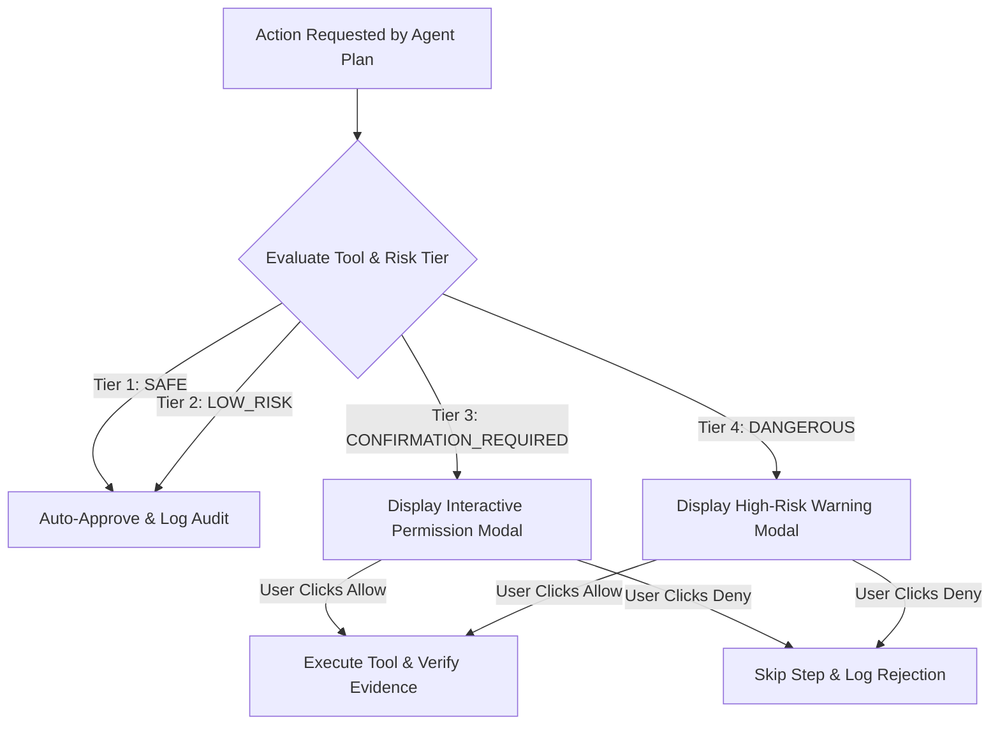

# AXIOM Security & Permission Philosophy

Security and user sovereignty are non-negotiable foundations of AXIOM. An autonomous AI operating on a Windows personal computer must be strictly bound by verifiable security controls.

---

## 1. The 4-Tier Risk Classification Model

Every tool and action in AXIOM is evaluated against a strict multi-tier security policy prior to dispatch:

### Risk Tier Definitions

| Tier | Description | Examples | Execution Policy |
| :--- | :--- | :--- | :--- |
| **SAFE** | Read-only operations that do not modify state or leak sensitive files | `list_files`, `read_file`, `git_status`, `git_diff`, `inspect_project` | Auto-approved in strict mode; logged to audit trail |
| **LOW_RISK** | Idempotent or reversible operations with minimal desktop impact | `launch_application`, `focus_window`, `get_clipboard`, `create_file` (in scratch) | Auto-approved with visual feedback |
| **CONFIRMATION_REQUIRED** | State modifications, network changes, or external service interactions | `modify_file`, `execute_powershell`, `git_commit`, `git_push`, web forms | **Requires user approval** before dispatch |
| **DANGEROUS** | Permanent destructive actions or critical OS modifications | `delete_file`, `delete_directory`, `force_push`, registry edits, kill process | **Requires explicit high-visibility confirmation** |

---

## 2. File Modification & Deletion Guardrails

1. **Existing File Modification Always Requires Confirmation**:
   - When asked to "fix this bug" or "update this code", AXIOM inspects the code, produces a concise diagnosis and diff plan, and requests grouped user approval before touching files.
2. **File Deletion is Permanently Dangerous**:
   - Even if the user requests *"Clean up this folder"*, AXIOM identifies candidates, displays the target files, explains why, and waits for approval. AXIOM will **never** silently delete files.

---

## 3. Secret Protection & Sanitization

- **No Hardcoded Credentials**: API tokens, personal keys, or passwords must never exist in repository code or configuration templates.
- **Audit Log Sanitization**: All actions written to `audit.jsonl` are automatically scrubbed through a recursive redaction filter that strips keys matching `password`, `token`, `secret`, `key`, `auth`, or `cookie`.
- **Environment Isolation**: `.env` and credential files are strictly ignored by `.gitignore` and flagged during pre-commit checks.

---

## 4. Prompt & Tool Injection Defense

AXIOM treats all external content as **untrusted data**, not executable instructions:
- Web pages fetched during research cannot hijack the agent or override the user's instructions.
- File contents read from repositories or documents cannot issue commands or escalate privileges.
- Tool outputs are strictly structured and verified by the runtime rather than evaluated as raw scripts.

---

## 5. Electron Desktop Sandboxing

- `contextIsolation: true`
- `nodeIntegration: false`
- `sandbox: true`
- Privileged operations can only occur in the main Node.js process through strongly-typed IPC handlers. The renderer process has zero access to the operating system shell or filesystem.
